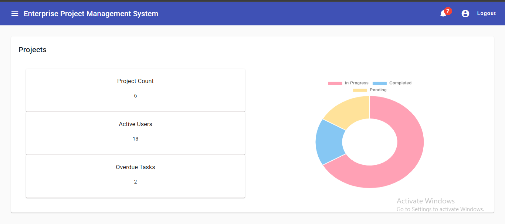
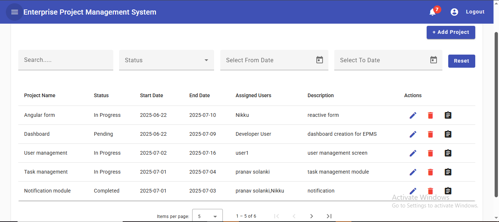
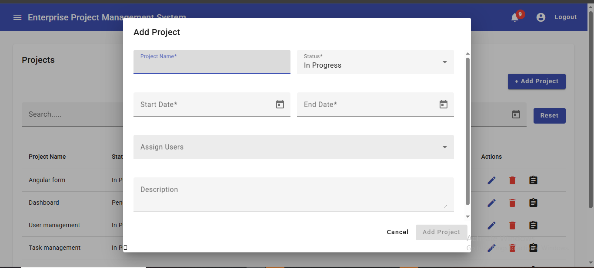
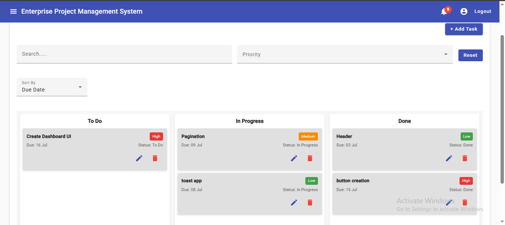
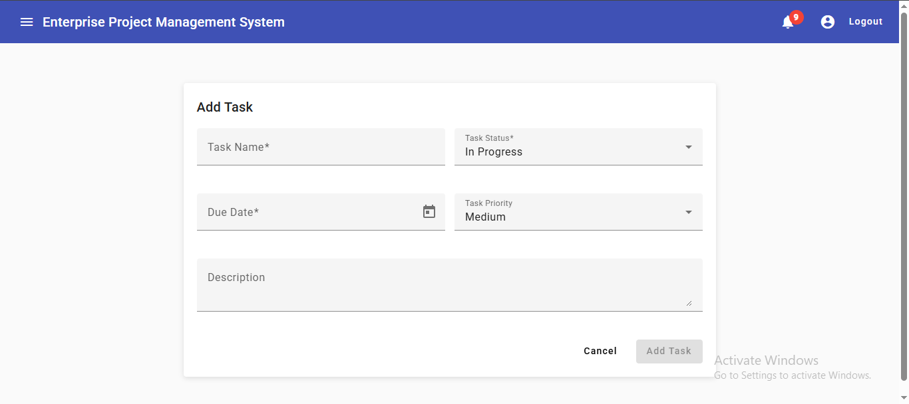
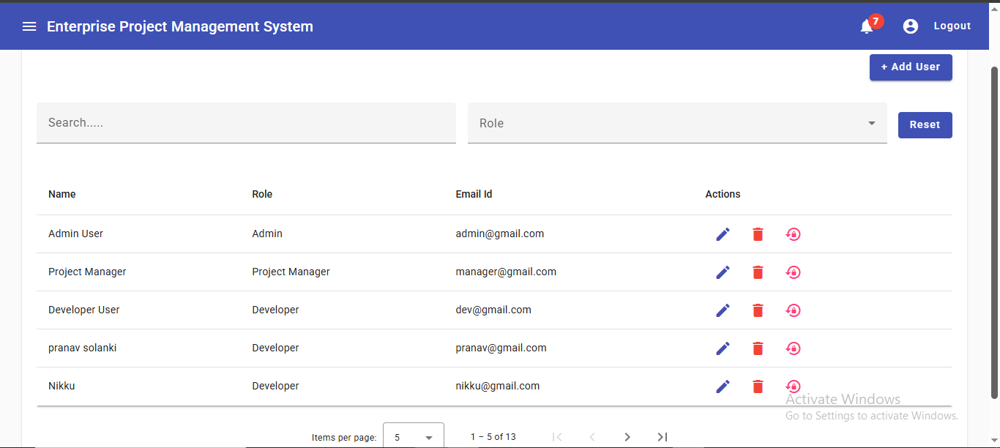
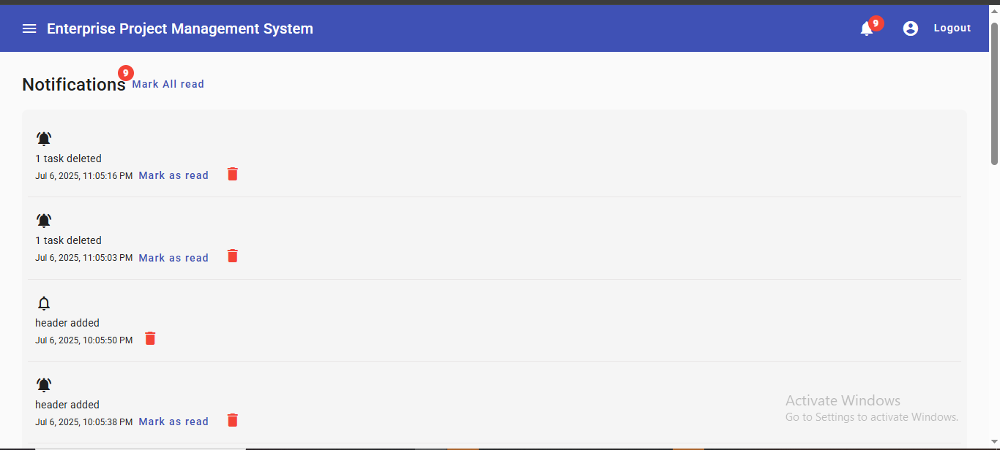

# 🚀 Enterprise Project Management System (EPMS)

A modular, scalable, and responsive enterprise-grade project management system built with Angular 16+, featuring real-time project & task tracking, role-based access control, and in-app notifications.

---

## 📌 Features
✅ Project & Task Management  
✅ User & Role Management (Admin, Project Manager, Developer)  
✅ Role-based Routing & Guards  
✅ Dashboard with KPIs, Charts (ngx-charts / Chart.js)  
✅ In-App Toast Notifications and Badge Alerts  
✅ Lazy Loading for Feature Modules  
✅ Angular Reactive Forms with Validations  
✅ Drag & Drop Task Reordering (Angular CDK)  
✅ API integration via json-server  
✅ Global Error Interceptor  
✅ Modular Architecture and Shared Components  

---

## 📸 Demo Screens (Optional)
## 📸 Project Screenshots

### 🟢 Login Screen


### 🟢 Signup


### 📊 Dashboard


### 📁 Project Management


### ➕ Add New Project


### 📋 Task Board


### 📝 Add New Task


### 👥 User Management (Admin Only)


### 🔔 Notifications & Toast Alerts


---

## 🛠️ Tech Stack  

- Angular v16+
- Angular Material
- RxJS
- ngx-charts / Chart.js
- json-server (Mock APIs)
- Angular CDK (DragDropModule)

---


## 📊 Functional Modules

- Authentication Module  
  Login by role (Admin, PM, Developer), JWT simulation, Route Guards  

- Dashboard Module  
  Project KPIs, Active Users, Overdue Tasks, Chart visualizations  

- Project Management Module  
  CRUD, pagination, sorting, assign users, search, status filter  

- Task Management Module  
  Nested under projects, Add/Edit/Delete, change status, Drag & Drop  

- User Management Module (Admin Only)  
  User CRUD, role management, password reset  

- Notifications Module  
  Toast Alerts, Badge Count, Alerts for Due Tasks, New Assignments  

---

## 📢 How to Run Locally

1️⃣ Clone the repository  
```bash
git: https://github.com/pranavsolanki-new/EPMS.git
json-server:  json-server --watch db.json 


